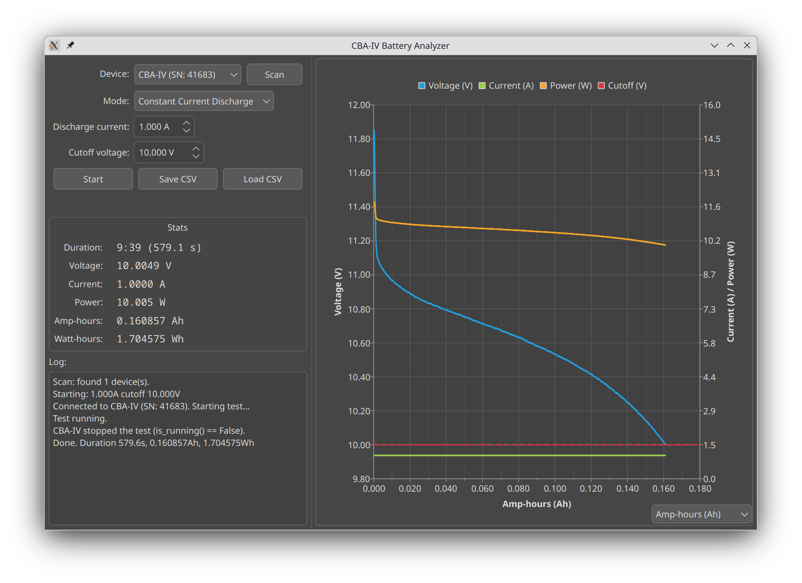

# wmr_cba_linux

Linux tools for West Mountain Radio CBA battery analyzers like the [CBA IV or CBA V](http://www.westmountainradio.com/cba.php).

These tools talk to the battery analyzer via libusb, using [da66en's python_wmr_cba library](https://github.com/da66en/python_wmr_cba/).

## Installation

On Debian and Ubuntu, install the python3-usb package:
```
sudo apt-get install python3-usb
```

For the GUI, install PySide6 (preferred) or PyQt6:
```
pip install PySide6
```
or:
```
pip install PyQt6 PyQt6-Charts
```

## Usage

### CLI

Run a battery test at 0.2A, with a cutoff voltage of 10.0VDC, showing stats
and writing a line to the battery.csv file every 10 seconds:
```
sudo ./cba_cli.py --amps 0.2 --cutoff 10.0 --interval 10 --csv battery.csv
```

- `--amps`: Discharge current, 0–40A (CBA IV hardware max)
- `--cutoff`: Cutoff voltage in volts
- `--interval`: Sampling/print interval in seconds (minimum 1.0, default 1.0)
- `--csv FILE`: Optional CSV log output

### GUI

Launch the graphical interface with live voltage/current/power charting:
```
sudo python3 cba_gui.py
```



Features:
- Device selector with scan button for multiple CBA devices
- Mode selector (currently Constant Current Discharge)
- Live chart (voltage/current/power) with cutoff voltage threshold line
- X axis toggleable between time and amp-hours, even mid-test
- Individual stat readouts for voltage, current, power, Ah, and Wh

## License

This project is licensed under the MIT License.  See the LICENSE file for
more information.

It includes third-party components licensed under MIT; see their respective
LICENSE files in the wmr_cba subdirectory for details.
